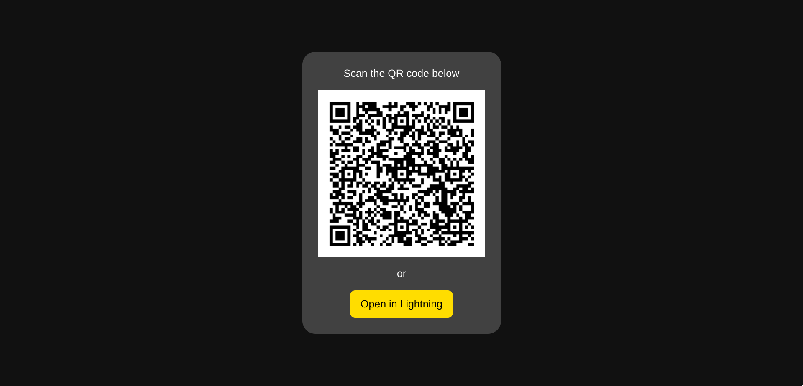

# LNURL-auth demo

A Go simple client-server application implementing LNURL-auth strategy based on the [LUD-04 RFC](https://github.com/fiatjaf/lnurl-rfc/blob/luds/04.md).



## Server

`cmd/server` directory contains a simple HTTP server implementing LNURL-auth authentication strategy. There is a web page showing the LNURL-auth URL that can be used for Bitcoin Lightning Wallet application to authenticate. After logging in, the server will show the public key of the authenticated user.

The server can be run using the following command:

```sh
go run ./cmd/server \
    --hostname http://localhost:8080 \
    --port 8080
```

## Client
